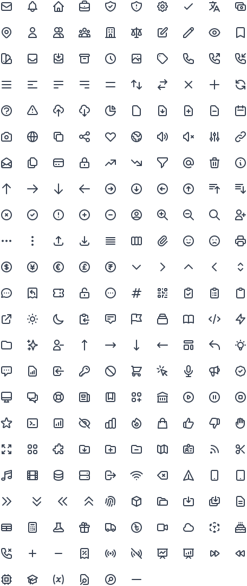
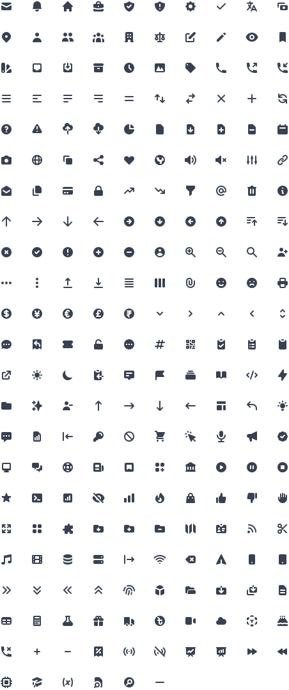

# `@ds-pack/heroicons`

This package is a fork / extension on top of the excellent
[Tailwind Heroicons](https://github.com/tailwindlabs/heroicons) project!

A set of free MIT-licensed high-quality SVG icons for you to use in your web
projects.

224 icons per style currently, more to come in the future.

[Preview and search at Heroicons.com](https://heroicons.com)

### Outline style

24x24 icons drawn with a stroke.

### Solid style

Smaller 20x20 icons drawn with fills.

